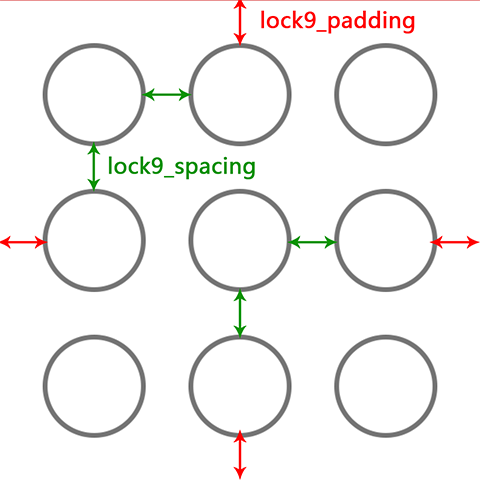
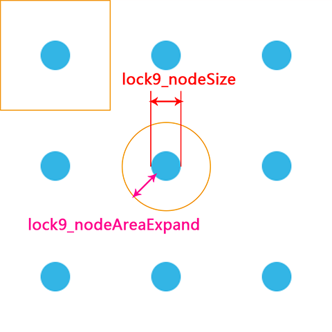
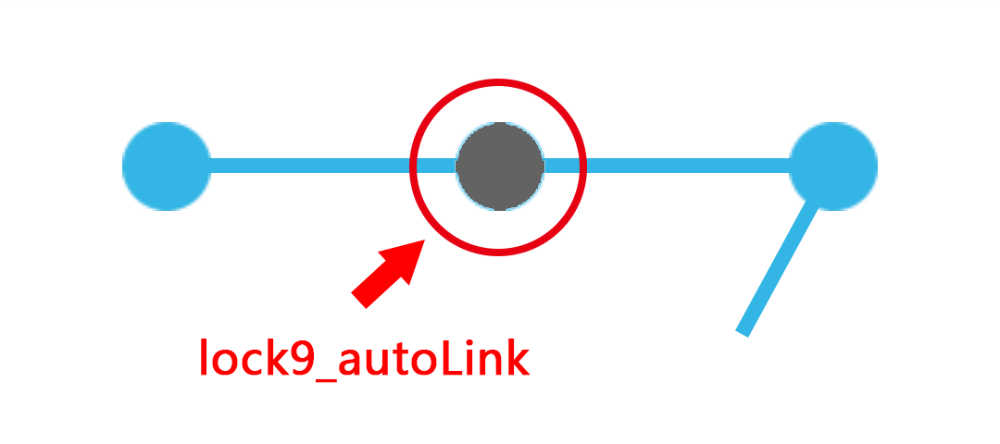

# Android Lock9View #

[](https://travis-ci.org/TakWolf/Android-Lock9View)
[](https://bintray.com/takwolf/maven/Android-Lock9View/_latestVersion)
[](https://www.android.com)
[](https://android-arsenal.com/api?level=14)
[](http://www.apache.org/licenses/LICENSE-2.0)
[](http://android-arsenal.com/details/1/1704)

An Android grid lock screen view with a callback interface.

## ScreenShot ##


## Demo ##

[](https://play.google.com/store/apps/details?id=com.takwolf.android.lock9)

## Usage ##

### Gradle ###

``` gradle
implementation 'com.takwolf.android:lock9view:0.1.3'
```

### Layout example 1 ###

``` xml
<com.takwolf.android.lock9.Lock9View
    android:id="@+id/lock_9_view"
    android:layout_width="match_parent"
    android:layout_height="wrap_content"
    android:layout_gravity="center"
    app:lock9_nodeSrc="@drawable/node_normal"
    app:lock9_nodeOnSrc="@drawable/node_active"
    app:lock9_nodeOnAnim="@anim/node_on_1"
    app:lock9_padding="28dp"
    app:lock9_spacing="28dp"
    app:lock9_lineColor="@color/blue_light"
    app:lock9_lineWidth="8dp"
    app:lock9_autoLink="false"
    app:lock9_enableVibrate="true"
    app:lock9_vibrateTime="20" />
```



### Layout example 2 ###

``` xml
<com.takwolf.android.lock9.Lock9View
    android:id="@+id/lock_9_view"
    android:layout_width="match_parent"
    android:layout_height="wrap_content"
    android:layout_margin="24dp"
    android:layout_gravity="center"
    app:lock9_nodeSrc="@drawable/node_small_normal"
    app:lock9_nodeOnSrc="@drawable/node_small_active"
    app:lock9_nodeOnAnim="@anim/node_on_2"
    app:lock9_nodeSize="16dp"
    app:lock9_nodeAreaExpand="24dp"
    app:lock9_lineColor="@color/blue_light"
    app:lock9_lineWidth="4dp"
    app:lock9_autoLink="true"
    app:lock9_enableVibrate="true"
    app:lock9_vibrateTime="20" />
```



**PS :**

**If use *"lock9_nodeSize"* , it will ignore *"lock9_padding"* and *"lock9_spacing"*.**

**The nodes will be layout on the center of 9 average areas.**

### Touch area ###

If you want to draw a small node with a bigger touch area, please user :

```
app:lock9_nodeAreaExpand="24dp"  // default is 0
```

touchArea = lock9_nodeSize + lock9_nodeAreaExpand * 2

### Animation ###

```
app:lock9_nodeOnAnim="@anim/node_on_2"
```

### AutoLink ###



```
app:lock9_autoLink="true" // default is false
```

### Vibrate ###

```
app:lock9_enableVibrate="true"  // default is false
app:lock9_vibrateTime="20"      // default is 20 milliseconds
```

Also need :

``` xml
<uses-permission android:name="android.permission.VIBRATE" />
```

### Activity ###

``` java
Lock9View lock9View = (Lock9View) findViewById(R.id.lock_9_view);
lock9View.setGestureCallback(new Lock9View.GestureCallback() {

    @Override
    public void onNodeConnected(@NonNull int[] numbers) {
        // Do something
    }

    @Override
    public void onGestureFinished(@NonNull int[] numbers) {
        // Do something
    }

});
```

## Change Log ##
 
### 0.1.0 ###

- This is a broken api version.

- Extend gesture callback.

## Limitations ##

这个项目很长时间出于非活跃状态，主要是手势解锁布局实现上存在一些限制。

一个完整的手势解锁布局，应该包括的功能有：

- 基本的手势连线

- 连接节点的动画

- 不同情况下的状态以及样式（常规、正确、错误状态时节点和连线颜色，以及停留时间）

- 布局策略（节点数量、触摸范围、连线和结点的层级关系）

- 反馈（连接节点时显示涟漪效果或者声音提示或者震动反馈）

我目前没有找到一个好的方法能够完美并且优雅的实现上面所有功能的扩展。

自己的几个关于手势解锁需求的项目，都是在这个基础上做了 UI 上的定制化修改。

## Author ##

TakWolf

[takwolf@foxmail.com](mailto:takwolf@foxmail.com)

[http://takwolf.com](http://takwolf.com)

## License ##

```
Copyright 2014 TakWolf

Licensed under the Apache License, Version 2.0 (the "License");
you may not use this file except in compliance with the License.
You may obtain a copy of the License at

    http://www.apache.org/licenses/LICENSE-2.0

Unless required by applicable law or agreed to in writing, software
distributed under the License is distributed on an "AS IS" BASIS,
WITHOUT WARRANTIES OR CONDITIONS OF ANY KIND, either express or implied.
See the License for the specific language governing permissions and
limitations under the License.
```
