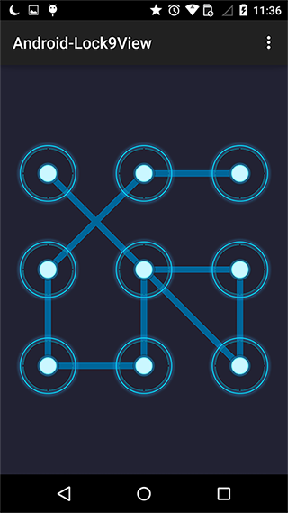

# Android-Lock9View   #

An Android grid lock screen view with a callback interface.

## ScreenShot ##

## Demo ##

## Usage ##

### Gradle ###

    compile 'com.takwolf.android:lock9view:0.0.5'

### Layout ###

    <com.takwolf.android.lock9.Lock9View
        android:id="@+id/lock_9_view"
        android:layout_width="match_parent"
        android:layout_height="wrap_content"
        android:layout_gravity="center"
        app:lock9_nodeSrc="@drawable/lock_9_view_node_normal"
        app:lock9_nodeOnSrc="@drawable/lock_9_view_node_highlighted"
        app:lock9_lineColor="#ff006699"
        app:lock9_lineWidth="8dp"
        app:lock9_padding="48dp"
        app:lock9_spacing="48dp" />

<b style="color:red">Attention!!!</b>

If you want to update library reference from version 0.0.4 or earlier,
you should add attributes "lock9_padding" and "lock9_spacing" in your layout to adjust node size(default is 0dp)
otherwise the node size will be changed.

<b style="color:red">Attention!!!</b>

If you want to update library reference from version 0.0.3 or earlier,
you should add a prefix "lock9_" to the Lock9View attributes in your layout, like :

    nodeSrc -> lock9_nodeSrc

This way to solve the resources error if another library has defined the same attributes like :

    "Attribute "xxx" has already been defined"

Thanks for <b>[@IGZpablocanamares](https://github.com/IGZpablocanamares)</b>.

### Activity ###

    Lock9View lock9View = (Lock9View) findViewById(R.id.lock_9_view);
    lock9View.setCallBack(new CallBack() {

        @Override
        public void onFinish(String password) {
            Toast.makeText(MainActivity.this, password, Toast.LENGTH_SHORT).show();
        }

    });

## What's next ##

Maybe add an error status.

## Author ##

TakWolf

[takwolf@foxmail.com](mailto:takwolf@foxmail.com)

[http://takwolf.com](http://takwolf.com)

## License ##

    Copyright 2015-2016 TakWolf
    
    Licensed under the Apache License, Version 2.0 (the "License");
    you may not use this file except in compliance with the License.
    You may obtain a copy of the License at

        http://www.apache.org/licenses/LICENSE-2.0

    Unless required by applicable law or agreed to in writing, software
    distributed under the License is distributed on an "AS IS" BASIS,
    WITHOUT WARRANTIES OR CONDITIONS OF ANY KIND, either express or implied.
    See the License for the specific language governing permissions and
    limitations under the License.